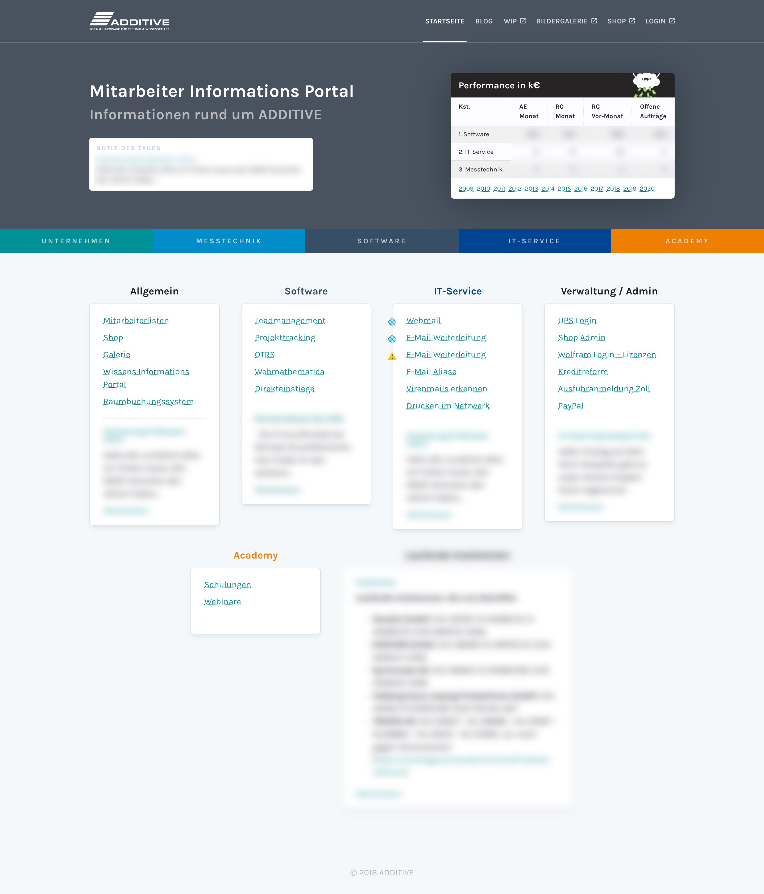
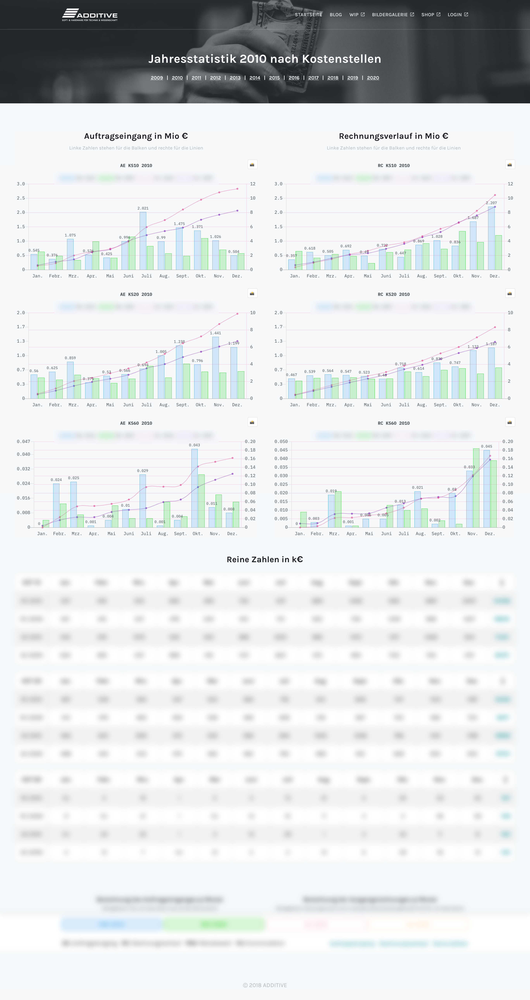
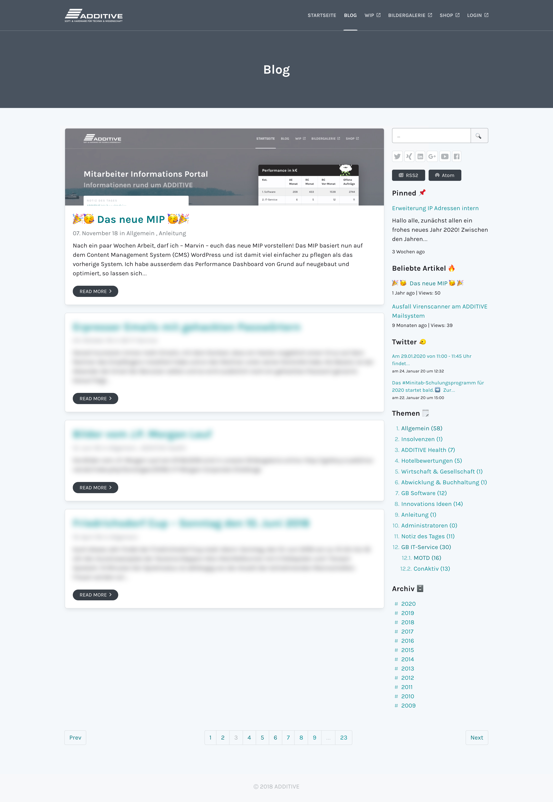
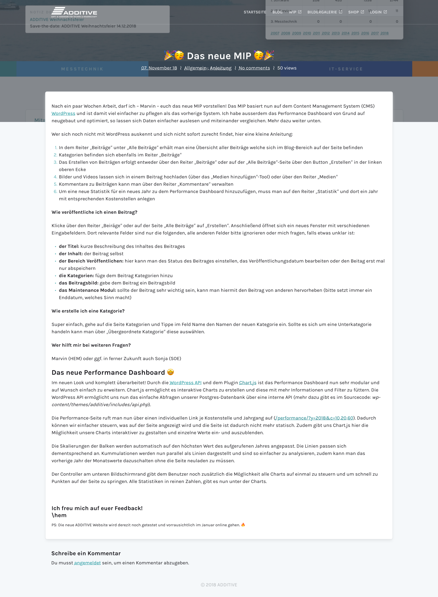

ADDITIVE has an interall tool for employees to see the company performance from the
beginning until now. It is also a blog where employees can post important information
about events for example.

I have re-created the complete website in Wordpress and also added an API for the
performance dashboard.

 
 
