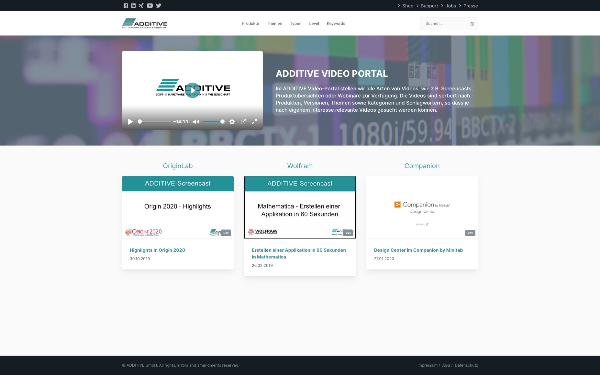
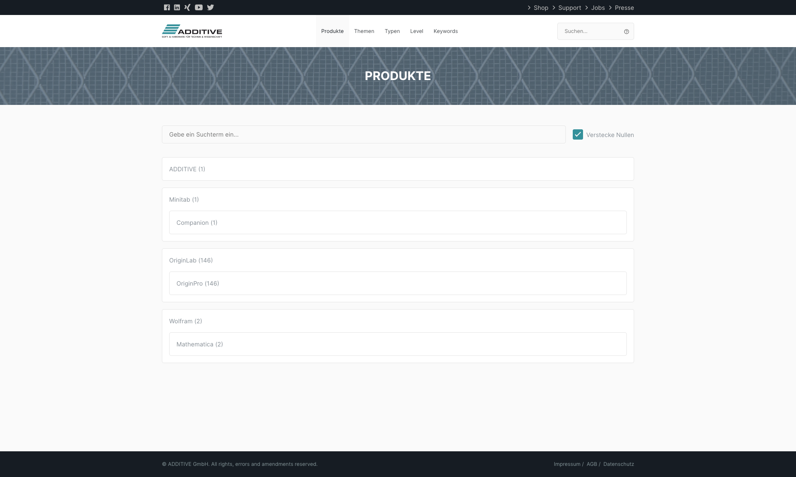
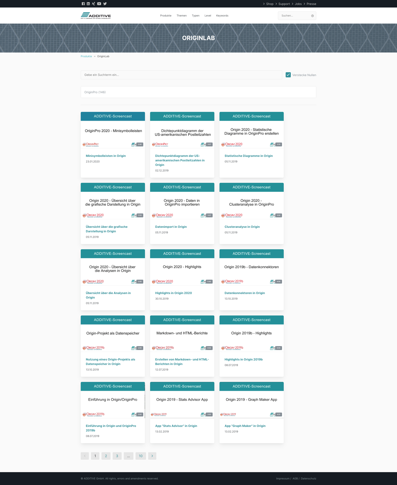
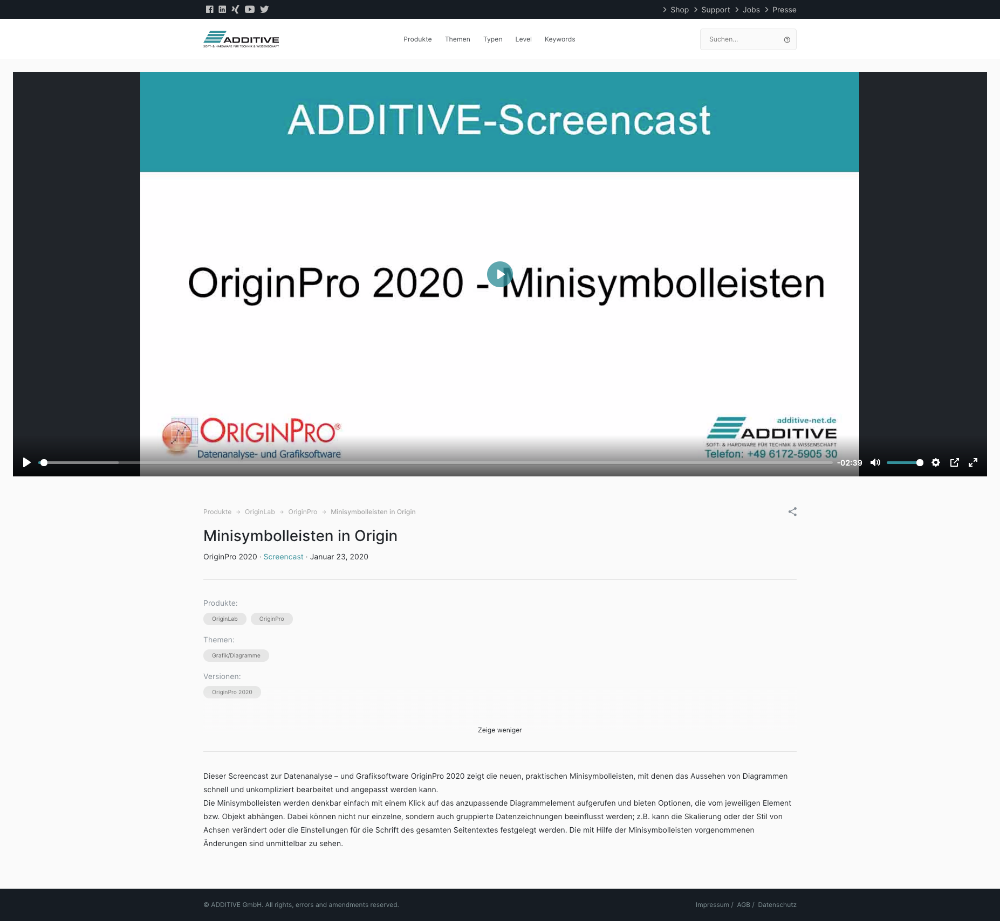
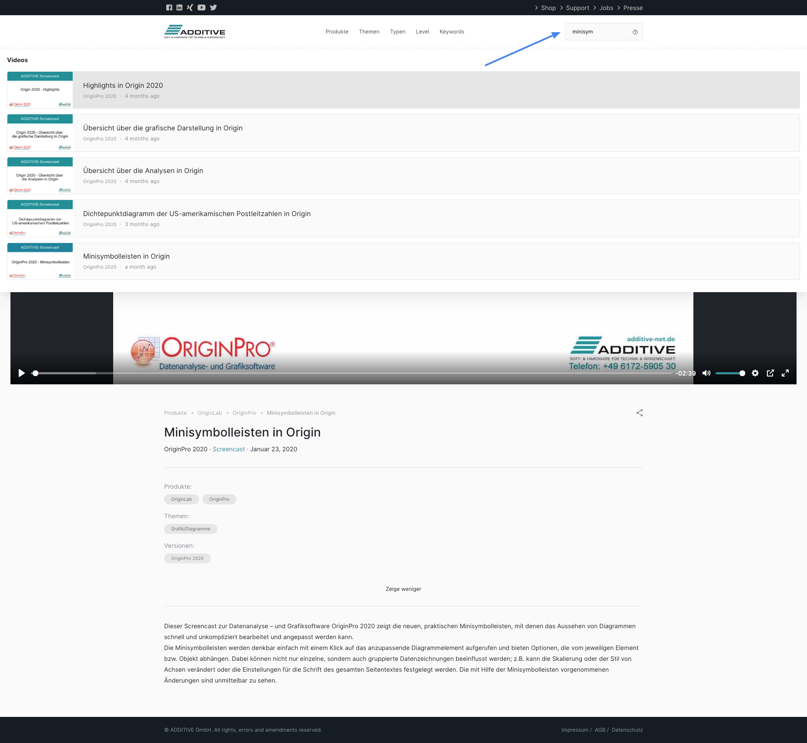

The CEO from ADDITIVE came with a wish to me. He wanted a video portal like YouTube or
Vimeo but with better labeling and a more explorer like functionallity. After we discussed
all the requirements I mailed him my idea of the ADDITIVE Video Platform. Below you can
see a list of features and some screenshots or you go directly to the platform on
https://video.additive-net.de/.

Features:

- Consistent design (see https://www.additive-net.de)
- Welcome (home) page with
  - Welcome autoplayed video
  - Welcome text
  - Modular component to display the most viewed or a highlighted video
- Wordpress as its backend
- Performance and modern technology
  - Web components
  - Webpack
  - less JS
- Advanced live searched (text based)
- Advanced category search page, see: https://video.additive-net.de/products/ or
  https://video.additive-net.de/themen/
  - Fast instant search
  - Hide empty categories
  - Beautiful design
- Embedded player
- UX first player design (with [Plyr](https://plyr.io/))

https://youtu.be/KReoYFdzP5o

|                                            |                                |
| ------------------------------------------ | ------------------------------ |
|                       |  |
|  |    |
|      |                                |
