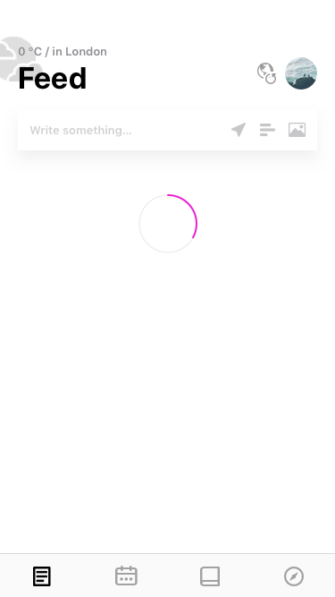
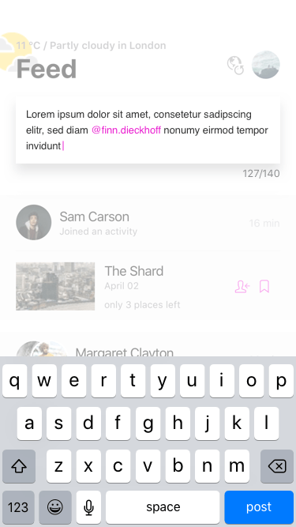
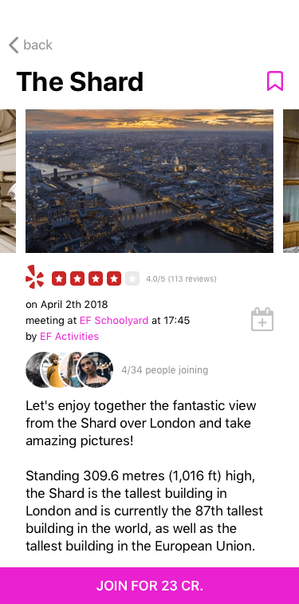
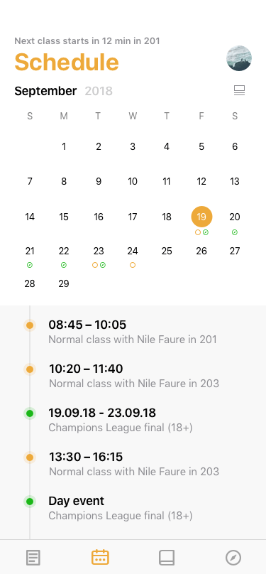
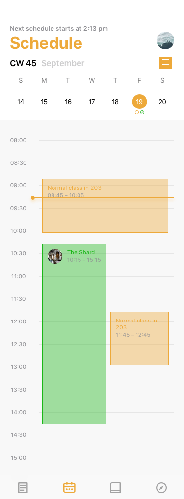
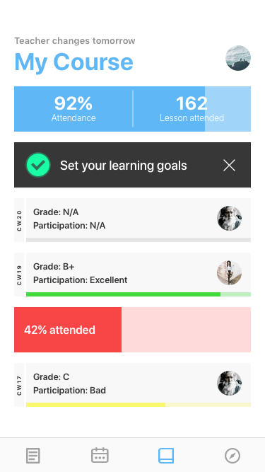
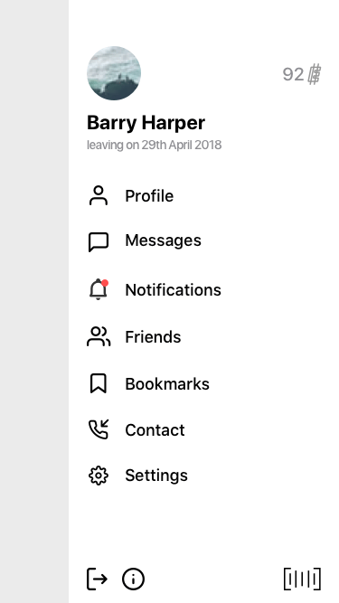
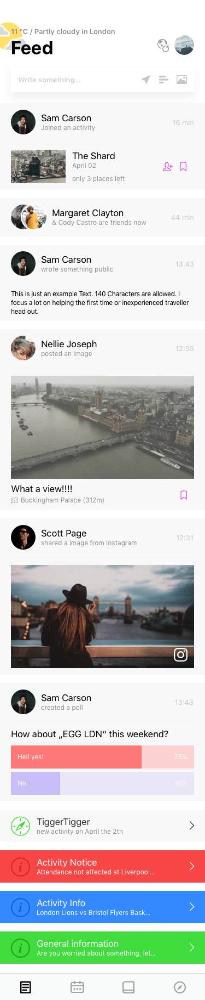

In a three-month trip to London, I visited the school **Education First** (EF). Before I
attended the trip I got some information material and that is where I saw that they have
an iOS application, which I downloaded immediately. I laughed at the first launch; this
app was really not the best looking or optimized for students. It was messy and most
features were just hard to use.

A few weeks later my trip started. The complete time I stayed at a residence provided by
EF, so only EF students there (Yay!). I found a handful of good friends there and one of
them was Finn. Finn is from Germany as well and was my room mate. Nice time, even nicer
memories.

Finn applied on two universities in Germany and one of them needed a presentation from
him. The requirements were simple; create an invented company and a product with a
detailed explanation + prototype or optimize an existing product. After he said the last I
immediately thought about that ugly EF app proposed to him to recreate the app and explain
each step. And he was thrilled because he thought the same as me about the app. So we
started together because I got nice experience in user design and experience and are
familiar with tools like InVision and Sketch.

After a few days we got our first prototype ready and also a small part of the
presentation. We asked friends and other EF students what they think about the progress
and idea so far. The resonance was amazing, most of the students felt the same as us, and
we got a lot of ideas and improvement suggestions. So to not take that too long, here is
the final product.

For an interactive prototype visit:
[Link to interactive prototype](https://invis.io/9RNG7GCYFKZ)

> Note: When you visit inVision, you can just click anywhere in the smartphone screen to
> let clickable elements appear.

 
 
 
 

  
