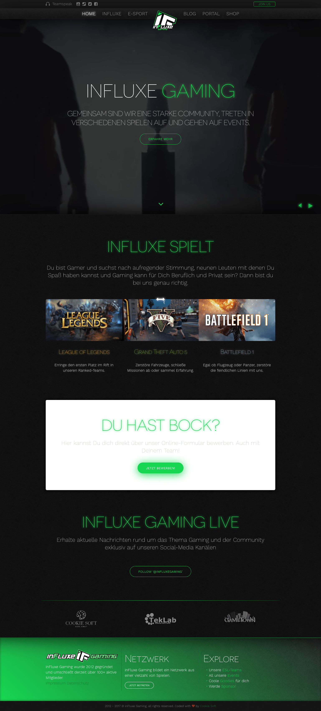

Back in the days I started a community project with Till where we tried to create a
community that combines multiple game and different people together, some will say that
this was the beginning of [M8FINDER](/projects/m8finder).

My job was to cordinate the development of the website. The first year I did it by myself
and optimized it more and more for our needs. But soon I saw that this takes too much
time, so we asked one from our community which was soon in my team to improve the website
with me together.

Besides making the website even better and better, I have been at most of the community
meetings every week and also created several internal tools like a CRM where we stored all
our members.

Interesting is the fact that the user database CRM was started as a side project but soon
got so powerful that we thought about commercializing it but rejected it, sadly (maybe
someday I will come back to that). The main features where: users from the forum, all
servers and the TeamSpeak3 server with actions to mute, ban, kick, approve or group them.
Also some features for severs where available.

At the end, inFluxe Gaming or how it was previously name TeamGeForce, got over 200 active
members and a huge website and server (mostly Counter Strike: Source) presence. Why it was
closed/cancelled? Simply we had not enough time while going to school and preparing for
life, but we often feel to start some kind of that again someday!

If you want to see a demo, it is not possible at the moment but I'm working on it.

