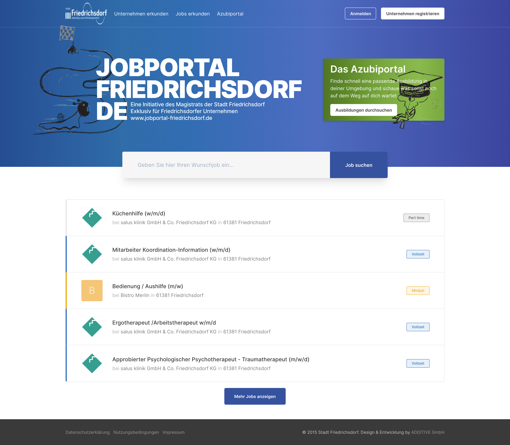
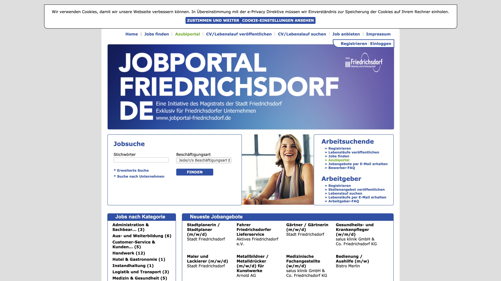

At ADDITIVE one of our customers is the city Friedrichsdorf for whom I have created a new
job portal.

Under the bonnet is a WordPress CMS working and a plugin to provide job portal feature. It
took a long time to modify this plugin but in the end I'm pretty proud about the end
design and result. I hope it will get a lot of attention now, cause the old design was…
Old, really old.

