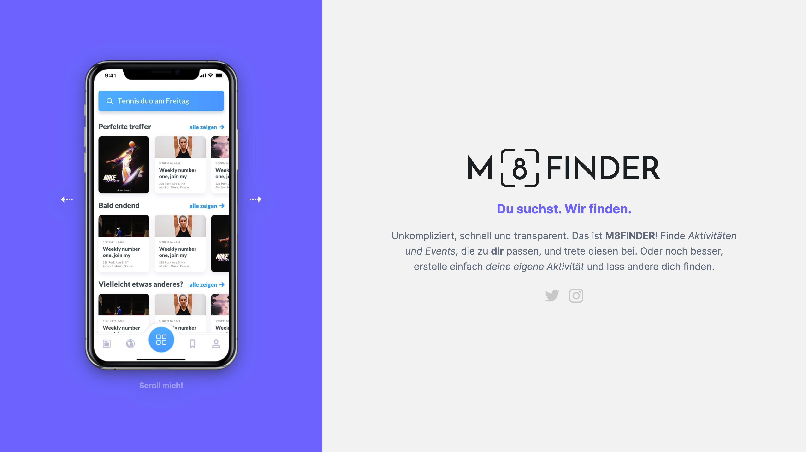
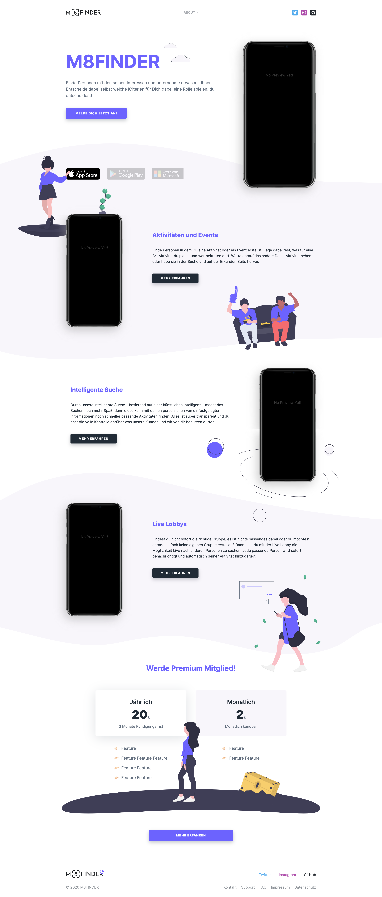
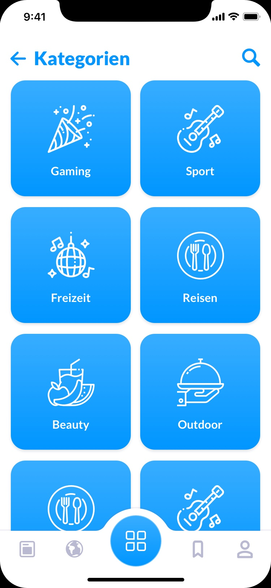
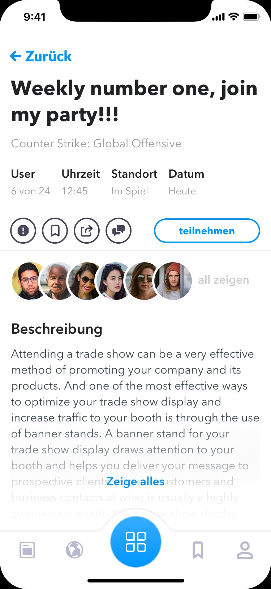
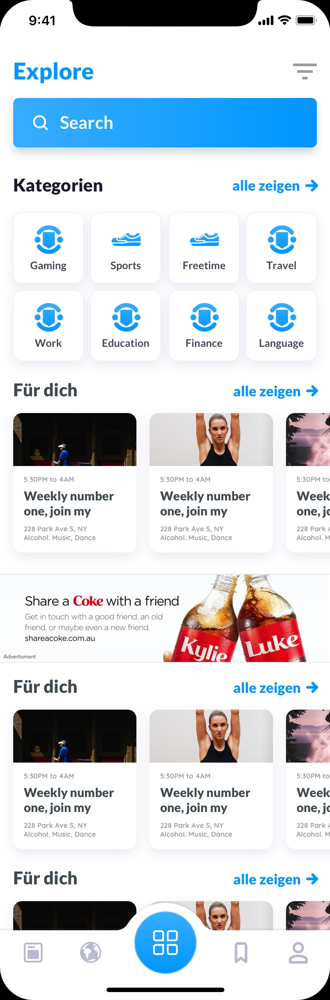
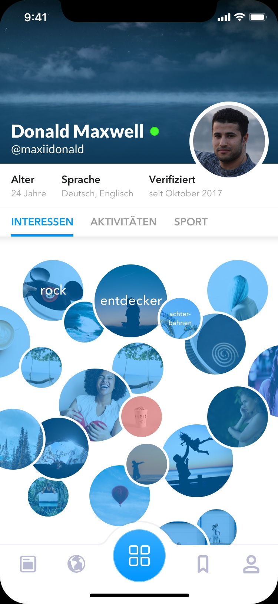
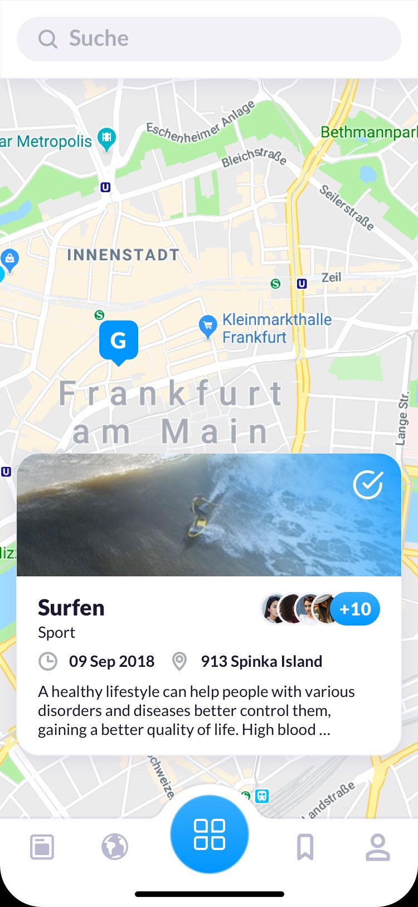
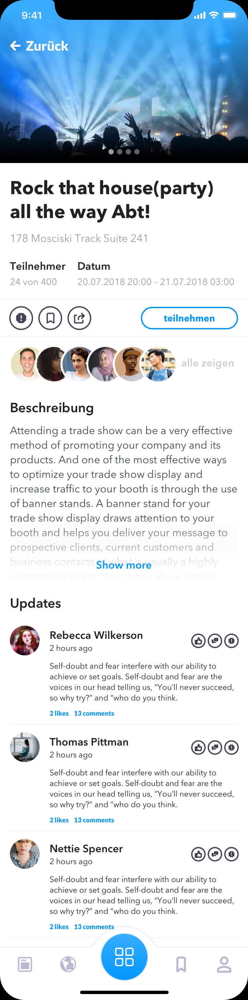
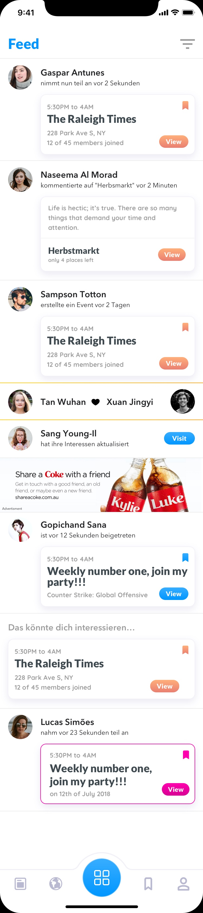

I'm working on this project for a very long time now. I'm the co-creator and partner of
M8FINDER and really proud about what we have done so far. It will change the industry in
thinking how social media should be done and will bring people back to meet in real life.

**M8FINDER** is in first place an app where you can search for other people with the same
interest. So you share playing tennis with someone, we got you. But it is even more!
Imagine you want to play tennis this weekend, none of your friends got time and you don't
want to stay at home alone; now go to M8FINDER and create a new activity, fill in the
requirements and wait for someone that shares that interest and get matched!

Tennis was an example I use very often here (because I play it) but M8FINDER can be used
for so much more. At the very beginning we just focused on gaming and thought about a way
people that play the same game could get together. After a few months we realized IT IS
much more, and we developed it in a more global/general way. No you can not even search
for someone to play Counter Strike with you, you can even filter those and see a map with
activities and events around you (If you want but just try it out).

**M8FINDER** is not **_LIVE_** yet but will come to your app store near you soon. Stay
tuned!

Here a some images, screenshots and previews:

|  |  |
| -------------------- | -------------------- |
|  |  |
|  | /                    |
|  |  |
